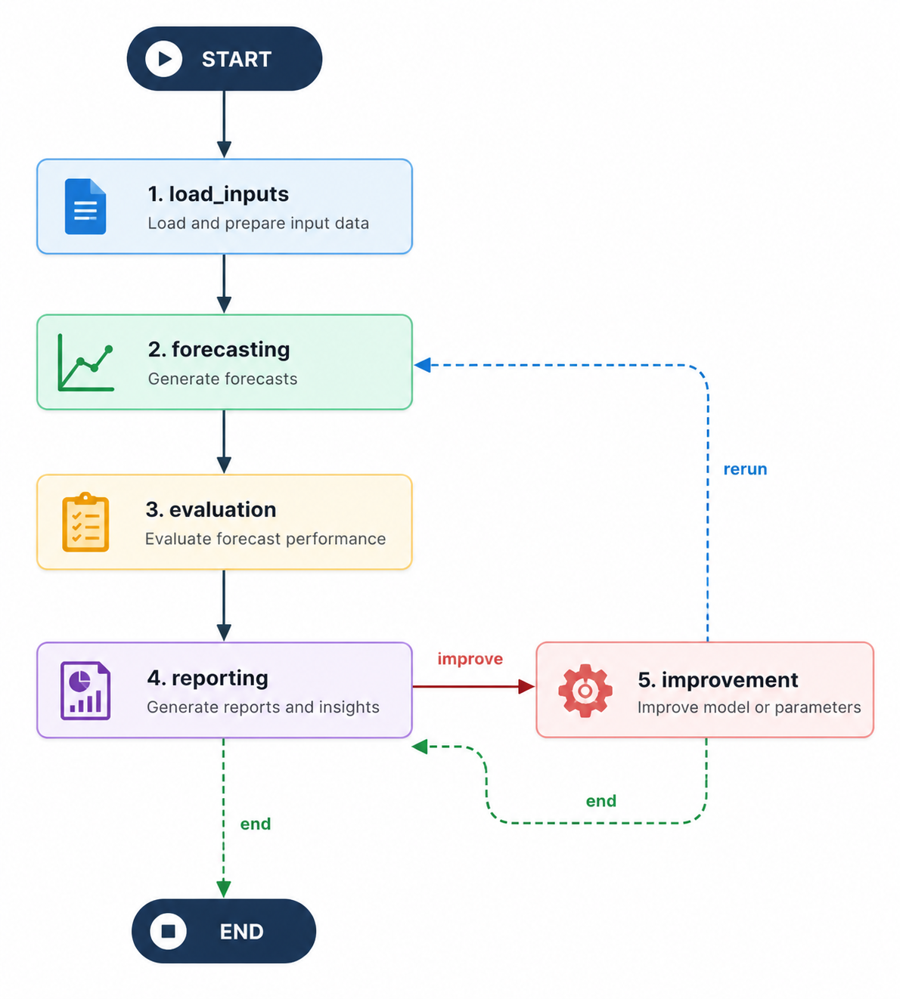

# Agentic Time Series Forecasting

A daily stock forecasting system built with a **multi-agent LangGraph workflow**. The default ticker is `NVDA`, but the pipeline can run with another ticker when the corresponding local data and model artifacts are available.

The project automates the full forecasting lifecycle: market data ingestion, preprocessing, XGBoost quantile model training, multi-day forecasting, risk evaluation, report generation, and model improvement through a retraining feedback loop.

## 1. LangGraph Workflow

The diagram below represents the top-level `DailyForecastingWorkflow`. It matches the nodes and conditional edges defined in `src/workflow/daily_forecasting_workflow.py`.



Node responsibilities:

| Node | Responsibility |
| --- | --- |
| `load_inputs` | Loads configuration, optionally fetches the latest market data, reads local historical data, resolves the latest usable model version, trains an initial model if needed, and loads previous reports. |
| `forecasting` | Calls `ForecastingAgent` to load quantile models and generate recursive forecasts for the configured horizon, including point forecasts, 80% confidence intervals, 95% confidence intervals, and holdout metrics. |
| `evaluation` | Calls `EvaluatorAgent` to compute the risk breakdown, news risk, trust score, and decision band. When a retrained candidate is being evaluated, this node also finalizes promotion or rejection. |
| `reporting` | Calls `ReporterAgent` to combine forecasts, risk signals, historical report trends, the final action, and JSON/Markdown report output. |
| `improvement` | Calls `ImprovementAgent` when the report requests `retrain`. The agent diagnoses the failure mode, trains temporary candidate models, and selects the best candidate for a workflow rerun. |

## 2. Main Agents

The system contains four main agents. Each agent is implemented as a focused LangGraph graph and owns one part of the end-to-end workflow.

| Agent | Main role | Important output |
| --- | --- | --- |
| `ForecastingAgent` | Loads quantile models and generates multi-day forecasts. | `forecasting_output`: predictions, confidence intervals, holdout metrics, diagnostics. |
| `EvaluatorAgent` | Evaluates forecast quality using model metrics, volatility, trend alignment, and news context. | `evaluation_output`: `trust_score`, `decision_band`, `risk_breakdown`, `news_context`. |
| `ReporterAgent` | Makes the operational decision using the current evaluation and historical reports. | `reporter_output`: `action`, `reason`, `composite_score`, `report_paths`. |
| `ImprovementAgent` | Attempts to improve the model when retraining is justified. | `improvement_output`: candidate path, candidate parameters, training metrics, promotion/rejection metadata. |

An important design choice is that `ImprovementAgent` **does not promote a model by itself**. It only trains and selects the best temporary candidate under `artifacts/models/tmp_*`. The workflow then reruns `ForecastingAgent` and `EvaluatorAgent` with that candidate. The candidate is promoted to a permanent `ver_N` directory only if the new evaluation is better than the previous model; otherwise, the candidate is deleted and the original model is kept.

## 3. Decision Logic

`EvaluatorAgent` calculates `trust_score` from several normalized risk signals:

- `holdout_mape_risk`
- `holdout_rmse_pct_risk`
- `interval_width_risk`
- `recent_volatility_risk`
- `trend_alignment_risk`
- `news_risk`

The weights and thresholds are configured in `configs/agent.yaml`. The default decision bands are:

| Condition | `decision_band` |
| --- | --- |
| `trust_score >= 70` | `accept` |
| `50 <= trust_score < 70` | `warning` |
| `trust_score < 50` | `retrain` |
| Black-swan news signal detected | `retrain`, with `trust_score = 0` |

`ReporterAgent` adds historical context before choosing the final action:

| Action | Meaning |
| --- | --- |
| `accept` | The forecast is trusted enough, or the main risk appears to come from market/news conditions rather than model failure. |
| `retrain` | The model shows degradation or the trust score is too low. |
| `accept_after_retrain` | A retrained candidate was promoted after being forecasted and evaluated again. |
| `reject_retrained_keep_old` | The retrained candidate did not outperform the old model, so the workflow restores the original model/output. |

## 4. Data and Artifacts

| Path | Purpose |
| --- | --- |
| `data/stocks.db` | SQLite database containing daily OHLCV market data. |
| `artifacts/models/ver_N/` | Permanent model versions, including quantile `.pkl` files and `metadata.json`. |
| `artifacts/models/tmp_*` | Temporary candidate models created during retraining. |
| `artifacts/reports/YYYY-MM-DD_TICKER_report.json` | Full structured report for tracing the entire workflow output. |
| `artifacts/reports/YYYY-MM-DD_TICKER_report.md` | Human-readable Markdown report for review and presentation. |

`data/` and `artifacts/` are ignored by git because they are generated runtime outputs.

## 5. Setup

Requirements:

- Python `3.10+`
- Network access for the first data fetch through `yfinance`
- `LLM_API_KEY` for the full LLM-backed agent workflow
- Optional `TAVILY_API_KEY` for news risk enrichment

```bash
python -m venv .venv
source .venv/bin/activate
pip install -r requirements.txt
cp .env.example .env
```

Minimum `.env` configuration:

```bash
LLM_API_KEY=your_key_here
LLM_PROVIDER=openai
LLM_MODEL=gpt-4o
LLM_TEMPERATURE=0.0
```

To disable Tavily/news search, leave it empty:

```bash
TAVILY_API_KEY=
```

## 6. Running the Pipeline

First run, with latest data fetch and automatic initial training if no usable model exists:

```bash
python scripts/run_daily_pipeline.py NVDA --fetch-latest
```

Later runs using local data:

```bash
python scripts/run_daily_pipeline.py NVDA
```

Run with a custom forecast horizon:

```bash
python scripts/run_daily_pipeline.py NVDA --horizon 7
```

The CLI prints a JSON summary containing the ticker, run ID, model version, trust score, decision band, action, composite score, report paths, and retraining details when applicable.

## 7. Manual Commands

Fetch or update market data:

```bash
python -c "from src.ingestion import fetch_stock_data; print(fetch_stock_data('NVDA'))"
```

Train a model manually:

```bash
python scripts/train_model.py NVDA
```

Run tests:

```bash
pytest -q
```

or:

```bash
python -m unittest tests.test_agents -v
```

## 8. Configuration

| File | Purpose |
| --- | --- |
| `configs/ingestion.yaml` | Default ticker, lookback window, retry settings, SQLite path. |
| `configs/preprocessing.yaml` | Feature engineering, target definition, train/test split. |
| `configs/model.yaml` | XGBoost parameters, quantiles, model artifact directory. |
| `configs/agent.yaml` | LLM settings, evaluator thresholds, risk weights, reporter history, retraining candidates. |
| `configs/app.yaml` | Langfuse observability settings. |

## 9. Project Layout

```text
configs/           YAML configuration
scripts/           CLI entry points
src/agents/        LangGraph agents
src/workflow/      DailyForecastingWorkflow
src/forecasting/   XGBoost trainer and predictor
src/ingestion/     yfinance fetcher and SQLite storage
src/preprocessing/ feature engineering and validation
src/prompts/       LLM prompt templates
src/utils/         config, scoring, logging, report writing
tests/             test suite
data/              local database, ignored by git
artifacts/         generated models and reports, ignored by git
```

## 10. Demo Notes

- Run `python scripts/run_daily_pipeline.py NVDA --fetch-latest` before the demo to generate fresh data and reports.
- If the grading environment has no network access or no Tavily key, set `TAVILY_API_KEY=` so the workflow does not depend on news search.
- The most important part of the README is the workflow diagram in section 1: it shows that the system does not simply forecast once, but uses the feedback loop `reporting -> improvement -> forecasting -> evaluation -> reporting` to validate a retrained candidate before accepting a new model.
